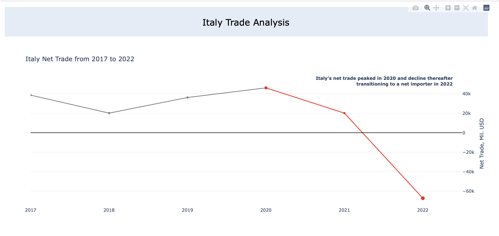

# Italy_Net_Trade_Visualization

 

## Overview

This project is focused on analyzing trade data of Italy from 2017 to 2022 to provide insights into the country's net trade. The goal is to present the data visually and provide valuable information regarding the Italian economy.

## Introduction

This project is designed to analyze Italy's trade data over a span of several years, with a focus on net trade. The project includes data visualization, helping to convey complex trade information in an easily digestible manner.

## Business Questions

Investors want to investigate Italy's recent shift to net importer, seeking insights into its overall impact and main cause. They also aim to understand Italy's key export and import markets, if they have changed and have a quick glance at them.

## Dataset
Source: WITS - World Integrated Trade Solution
World Integrated Trade Solution (WITS) allows you to download up to 10,000 rows per download, so to collect all data from 2017 to 2022, we need to download in two trances and merge them together.

The two datasets are Ita_Trade1720.csv and Ita_Trade2122.csv

## Plotly Visualization
Plotly plots (and other interactive JavaScript-based visualizations) don't always render directly on GitHub, so I have uploaded the Visualization output and the HTML file together with the Jupyter notebook.

## Technologies Used

- Python
- Pandas
- Plotly

